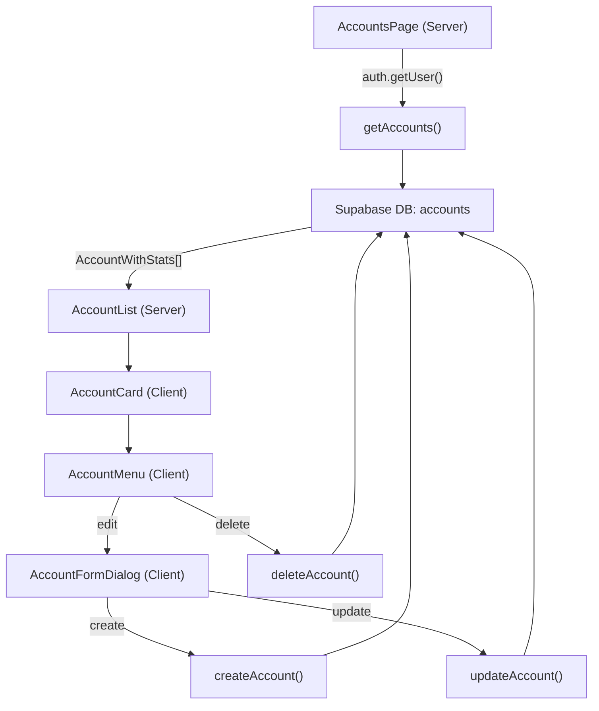

# Account Management — MVP Architecture

> Last updated: 2026-03-15
> Follows `.cursorrules` conventions. JSONB placeholder fields use `unknown` (the rules ban `any`; `unknown` serves the same MVP purpose without violating the constraint).

---

## 1. TypeScript Types — `/lib/types/accounts.ts`

```typescript
// AccountType — mirrors the DB enum exactly
export enum AccountType {
  ASSET     = 'ASSET',
  LIABILITY = 'LIABILITY',
  SHARE     = 'SHARE',
}

// Account — core DB fields; JSONB fields are placeholder unknown for now
export interface Account {
  id:              string;
  user_id:         string;
  name:            string;
  type:            AccountType;
  balance:         number;
  credit_limit:    number | null;
  currency:        string;
  reward_rules:    unknown;   // RewardRule[] — fill in Phase 2
  reward_balances: unknown;   // Record<string, number> — fill in Phase 2
  spend_stats:     unknown;   // Record<string, number> — fill in Phase 2
  auto_pay_config: unknown;   // AutoPayConfig — fill in Phase 2
  created_at:      string;
  updated_at:      string;
}

// AccountWithStats — display layer; adds only available_credit
export interface AccountWithStats extends Account {
  available_credit: number | null; // LIABILITY only: credit_limit + balance
}
```

**Calculation rule**: `available_credit = credit_limit + balance`
A credit card's `balance` is negative (money owed), so adding it to `credit_limit` yields the remaining available credit with no special sign handling required.

---

## 2. Server Actions — `/lib/actions/accounts.ts`

Fixed pattern for every action:

```
createClient() → supabase.auth.getUser() → DB operation → return ActionResult<T>
```

### 2.1 `getAccounts`

```typescript
export async function getAccounts(): Promise<ActionResult<AccountWithStats[]>>
```

- Call `createClient()`, then `getUser()` to obtain `user.id`
- `supabase.from('accounts').select('*').eq('user_id', user.id).order('created_at')`
- RLS already enforces isolation at the DB layer, but the explicit `user_id` filter guards against a future RLS disable
- Map each row: `available_credit = type === LIABILITY ? (credit_limit ?? 0) + balance : null`

### 2.2 `createAccount`

```typescript
type CreateAccountInput = Pick<Account, 'name' | 'type' | 'balance' | 'currency'> & {
  credit_limit?: number;
}
export async function createAccount(input: CreateAccountInput): Promise<ActionResult<Account>>
```

- `getUser()` → merge `{ ...input, user_id: user.id }` → `.insert().select().single()`
- MVP skips Zod but retains a basic null/undefined guard

### 2.3 `updateAccount`

```typescript
type UpdateAccountInput = Partial<Pick<Account, 'name' | 'balance' | 'credit_limit'>>
export async function updateAccount(id: string, input: UpdateAccountInput): Promise<ActionResult<Account>>
```

- `getUser()` → `.update(input).eq('id', id).eq('user_id', user.id).select().single()`
- The double `eq` condition ensures a user can only modify their own records (row-level isolation)

### 2.4 `deleteAccount`

```typescript
export async function deleteAccount(id: string): Promise<ActionResult<null>>
```

- `getUser()` → `.delete().eq('id', id).eq('user_id', user.id)`
- MVP does not cascade-check related transactions before deletion

---

## 3. Component Tree

```
app/(dashboard)/accounts/page.tsx          ← AccountsPage [Server Component]
  └─ components/features/accounts/
       ├─ AccountList.tsx                  ← [Server Component] receives accounts array
       │    └─ AccountCard.tsx             ← [Client Component] display + progress bar
       │         └─ AccountMenu.tsx        ← [Client Component] edit / delete menu
       └─ AccountFormDialog.tsx            ← [Client Component] create / edit dialog
```

### Component Responsibilities

**`AccountsPage` (Server Component)**

- `import { createClient } from '@/lib/supabase/server'`
- `const { data: { user } } = await supabase.auth.getUser()`
- Not logged in → `redirect('/login')`
- Logged in → call `getAccounts()` → pass result to `AccountList`

**`AccountList` (Server Component)**

- Props: `accounts: AccountWithStats[]`
- Groups accounts by `type`: three sections — ASSET / LIABILITY / SHARE
- Renders an `<AccountCard>` for each account

**`AccountCard` (Client Component)**

- Props: `account: AccountWithStats`
- Displays: account name and `formatCurrency(balance, currency)`
- If `type === 'LIABILITY'` and `credit_limit` is not null:
  - Renders a shadcn `<Progress>` bar
  - Value = `Math.abs(balance) / credit_limit * 100` (percentage used)
  - Label: amount used / total limit
- Contains `<AccountMenu>`

**`AccountMenu` (Client Component)**

- Props: `accountId: string`
- shadcn `<DropdownMenu>` with two items: Edit and Delete
- Edit: fires parent `onEdit` callback → opens `AccountFormDialog`
- Delete: calls `deleteAccount(accountId)` → `router.refresh()`

**`AccountFormDialog` (Client Component)**

- Shared dialog for both create and edit modes
- Props: `mode: 'create' | 'edit'`; edit mode also receives `account: Account`
- shadcn `<Dialog>` + hand-written `<Form>` (no React Hook Form — MVP simplicity)
- On submit: calls `createAccount` or `updateAccount` → `router.refresh()`

---

## 4. Key Decisions

### 4.1 Auth Pattern (used in every action)

```typescript
// Fixed 3-line header at the top of every Server Action
const supabase = await createClient();          // lib/supabase/server.ts
const { data: { user } } = await supabase.auth.getUser();
if (!user) return { success: false, error: 'Unauthenticated' };
```

- Always use `getUser()`, never `getSession()` (required by rules — verifies the JWT)
- Supabase RLS policies also isolate by `user_id`, providing a second layer of defence

### 4.2 `available_credit` Calculation

```typescript
available_credit = account.credit_limit !== null
  ? account.credit_limit + account.balance   // balance is negative
  : null
```

Pure in-memory map — no DB round-trip. Computed inside `getAccounts` before returning.

### 4.3 ActionResult Convention

Every action must return:

```typescript
type ActionResult<T> = { success: true; data: T } | { success: false; error: string }
```

### 4.4 Intentional MVP Simplifications

| Decision | MVP approach | Future upgrade |
|---|---|---|
| JSONB field types | `unknown` placeholder | Fill in `RewardRule[]` etc. |
| Form validation | Basic null check | Add Zod schema |
| Delete guard | Hard delete, no checks | Verify no related transactions |
| Currency conversion | No cross-currency conversion | `convertCurrency` util |
| SHARE market value | Not displayed | Phase 3: price API integration |

---

## 5. Data Flow Overview


